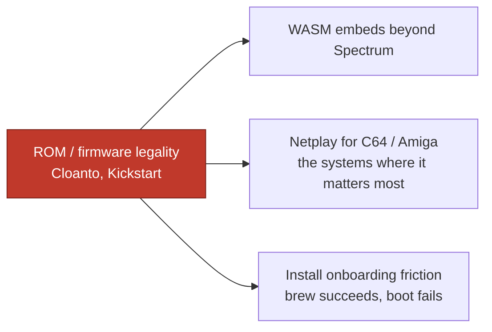

# Ideation: Best-in-Class Strategy Stress-Test

Seven survivors from 44 candidates across five ideation frames. The most useful result of the pass was negative: a fresh-context verifier, checking each candidate against the *actual* unpushed branch content, found that many apparent "gaps" are already covered by the `2026-07-03-best-in-class-programme.md` workstreams (netplay is W6, the public compatibility database is W4, the fleet-wide accuracy harness is W1, resolving `isa-disasm` first is already the plan). Those were cut as basis-inflation. What survives is the set of things the recorded strategy genuinely does not yet resolve — and every one is cheap to settle now, while the branches are unpushed.

The through-line: the recorded strategy is strong on the *engineering* programme (the six workstreams are concrete and well-sequenced) but leaves four *positioning and resourcing* questions implicit — the mission↔campaign tension, single-author fragility, ROM-legality as a strategic gate, and who the differentiators are actually for. Those are the survivors.

## Grounding Context

**Codebase context.** Emu198x: Rust workspace, 198 crates, cycle-accurate multi-system emulator (28 systems), solo developer (Steve) + LLM agents, GPL-2.0-or-later. The best-in-class strategy adopted 2026-07-03 (unpushed `best-in-class-strategy` branch, 467 insertions): win as the best consistent multi-system suite; staged reference-class campaigns (Spectrum → NES/GB → C64 → Amiga standing); effort calibrated by competitive tier; four moats (agent-native MCP tooling, embeddable dual-licensed crates, browser/curriculum embeds, heterogeneous netplay); six workstreams W1–W6.

**Load-bearing tension confirmed against the records.** `emu198x-mission.md` names macOS/Linux gap-fill as a *primary* mission, but the four campaign systems are exactly where living cross-platform incumbents already exist (Fuse, VICE, Mesen2/SameBoy) — the real "no native option" gap sits in the 22 extended systems the campaign structure deprioritizes. The mission's "why" and the campaign's "where" point in different directions, and no record resolves it.

**Resourcing reality.** Single-author project, LLM-assisted; no `FUNDING.yml`; single Code-of-Conduct enforcement contact; high-friction contributor path (44 decision records + RULES.md before a PR); `crate-licensing-split.md` notes the single-author licensing convenience "decays the moment external contributions land" but no CLA/DCO exists yet. External precedent: higan nearly died at founder burnout (survived as ares via fork-friendly succession); mGBA is bus-factor-1; 73% of OSS devs report burnout.

**Accuracy bar is locked and non-negotiable** — no survivor touches it.

## Topic Axes

- victory-condition-and-positioning
- campaign-structure-and-sequencing
- moats-and-differentiators
- resourcing-and-community
- audience-and-distribution

## Ranked Ideas

### 1. Reconcile the Spectrum-first / gap-fill-mission paradox in the record, explicitly

**Description:** The umbrella best-in-class record should add one paragraph acknowledging that the campaign order optimizes the Code198x/Crash! Live anchor and "most-beatable incumbent," *not* the mission's stated primary (macOS/Linux gap-fill) — and say why that trade is deliberate. Spectrum is the single most crowded incumbent field of the four headliners (Fuse, ZEsarUX, EightyOne, CSpect, SpecEmu and more), while the actual platform gap lives in the extended systems. This isn't an argument to reorder the campaigns — it's an argument to stop leaving the contradiction implicit.

**Axis:** victory-condition-and-positioning

**Basis:** `direct:` `emu198x-mission.md` names cross-platform gap-fill "a primary Emu198x mission … some systems have NO macOS or Linux emulator available"; cross-read against the campaign order, where 3 of 4 systems already have maintained cross-platform incumbents. Verifier confirmed the tension against the live mission record and the Spectrum incumbent count in `emulators/zx-spectrum/INDEX.md`.

**Rationale:** An unstated contradiction between two binding records is how a future session silently "resolves" it by drift — picking whichever record it happened to read first. Naming it converts a latent inconsistency into a deliberate, defensible choice before it can be litigated by accident. It also protects the campaigns: with the trade stated, "why isn't the gap-fill mission driving this?" has a written answer.

**Downsides:** Forces an honest admission that "primary mission" language is aspirational relative to where effort goes; may invite pressure to actually reprioritize toward extended systems (which is a real, separate decision, not this one).

**Confidence:** 85%
**Complexity:** Low

### 2. Write the succession / continuity plan now, and make "resumable" a release criterion

**Description:** Add a short succession record (licence status, which decisions are load-bearing vs discardable, publish credentials, org ownership, security-contact continuity) and adopt a lightweight "a competent stranger + Claude could resume this" as a stated property the knowledge base and tooling are meant to preserve. Pair it with a *human* low-friction lane for the two roles that don't need the 44-record onboarding: catalogue-manifest authors and hardware-capture submitters.

**Axis:** resourcing-and-community

**Basis:** `direct:` `crate-licensing-split.md` — the single-author convenience "decays the moment external contributions land"; no `FUNDING.yml`, single enforcement contact, no continuation record (verified). `external:` higan→ares and youtube-dl→yt-dlp survived founder-exit only via fork-friendly succession; mGBA bus-factor-1; 73% OSS burnout.

**Rationale:** The unpushed branch *adds* solo-operator load — hardware rigs, four concurrent workstreams, a publishing obligation — without touching continuity. Every accuracy investment in the programme is contingent on one person's sustained output for years; the cheapest possible moment to buy continuity insurance is before that complexity compounds. The project's own schema-bound knowledge base is an unusually strong succession asset — but only if it's explicitly packaged as one.

**Downsides:** Feels premature with no contributors today; the low-friction lane needs a guardrail so it doesn't erode the architectural-contribution bar that exists for good reasons. Note the fork worth deciding explicitly: a succession *plan* (a document) vs succession as a *release criterion* (a tested property) are different commitments — pick knowingly.

**Confidence:** 85%
**Complexity:** Medium

### 3. Make ROM-legality a first-class workstream, not README prose

**Description:** Promote firmware/ROM legality from a documented per-system footnote to a named workstream with an owner. It is the single non-code constraint that gates the most strategic surface at once — and the umbrella already has `canonical-outreach-catalogue.md` built for exactly this manufacturer-outreach shape, so this plugs into existing infrastructure rather than inventing process. Either pursue the Cloanto/Kickstart conversation as real strategy, or deliberately concentrate the browser and netplay moats on firmware-free systems (NES, Spectrum, Game Boy) and record that as the chosen scope.

**Axis:** moats-and-differentiators

**Basis:** `direct:` `wasm-sequencing.md` / moats evidence — "Firmware legality still excludes C64/Amiga embeds (Cloanto/Kickstart) until separately resolved." Verifier confirmed the `canonical-outreach-catalogue.md` outreach infrastructure exists.

**Rationale:** One blocker touches three initiatives simultaneously — and it's the *high-prestige* systems that are gated:

Treating a constraint this load-bearing as an "external given" means three moats quietly inherit a cap nobody owns. Naming it as work — even work whose conclusion is "we accept the firmware-free scope" — is higher-leverage than any single accuracy sprint.

**Downsides:** Manufacturer licensing outreach is slow, uncertain, and may simply fail; the fallback (firmware-free-only browser/netplay scope) narrows two moats on the two flagship systems. Either way the answer costs calendar time the campaigns want.

**Confidence:** 80%
**Complexity:** Medium

### 4. Name the fourth audience (ML/agent research) and redirect the "consistency" pitch to who feels it

**Description:** Two moves that reinforce each other. First, name a fourth audience the strategy currently omits: ML/RL and LLM-agent researchers (and TAS/speedrun verifiers) who select on determinism + scriptability + accuracy — precisely the properties the project over-invests in "for craft reasons." A Gymnasium-compatible wrapper and a PyPI presence reach them at near-zero incremental engineering. Second, stop marketing "best consistent multi-system suite" to end-users (who, per `no-unified-launcher.md`, think per-system and never experience the suite *as* a suite) and aim the consistency claim at the two parties who actually feel it: crate embedders and researchers.

**Axis:** audience-and-distribution

**Basis:** `external:` Stable-Retro/Gymnasium and GamingAgent (ICLR 2026) — deterministic scriptable emulators are already an ML-benchmark substrate. `direct:` `no-unified-launcher.md` — "A unified launcher would serve users this project doesn't have"; users think per-system, confirming the consistency claim has no end-user receiver.

**Rationale:** This retroactively justifies existing investment (determinism, MCP, headless scriptability) as a deliberate strategic bet rather than incidental engineering taste, and opens a distribution channel (PyPI, academic citation) with zero overlap with the ROM-legality problems that constrain the other three audiences. The consistency reframe costs nothing but a positioning edit and stops a headline claim from being aimed at an audience that can't receive it.

**Downsides:** A research audience wants API stability and a wrapper the project would then have to maintain; over-indexing on it could pull scope toward benchmark tooling and away from accuracy. Naming it is cheap; serving it is a commitment to scope carefully.

**Confidence:** 80%
**Complexity:** Low

### 5. Elevate the hardware-measured-truth corpus to the primary named moat

**Description:** Reframe the strategy's headline differentiator. Of the four named moats, three are ultimately copyable features — a maintained incumbent could add MCP, publish crates, or ship WASM. The one asset no competitor can retroactively backfill is original hardware measurement from Steve's specific rigs, landing in `reference/` as a citable, provenance-tagged corpus. Make *that* the primary moat and treat the SQLite-style public test methodology as its companion artifact (methodology-as-trust, distinct from the data itself).

**Axis:** moats-and-differentiators

**Basis:** `direct:` moats evidence / W3 — "the graduation from *consuming* accuracy research … to *producing* it," with the milestone "publish a test ROM an incumbent fixes a bug against." `external:` NIST/BIPM reference-data authority; SQLite's public TH3/MC-DC methodology as the trust engine behind ubiquitous embedding.

**Rationale:** Moat durability, not readiness, should decide what gets called the headline. A durability ranking of the four:

| Moat | Could a resourced incumbent copy it? |
|------|--------------------------------------|
| Agent-native MCP tooling | Yes — build the same surface |
| Embeddable crates | Yes — extract their own |
| Browser/curriculum embeds | Yes — compile to WASM |
| **Hardware-measured corpus** | **No — the specific captures can't be backfilled by anyone else** |

The strategy currently buries the corpus as a "supporting commitment" under W3/tier framing. Naming it the primary moat aligns the positioning with the one thing that's genuinely uncopyable — and an emulator *other emulators cite* exits the feature race entirely.

**Downsides:** The corpus is the most expensive and slowest asset to actually build (hardware, flux imaging, logic capture); elevating it rhetorically before it exists risks a claim outrunning the evidence. The reframe is cheap; the substance behind it is W3's multi-month cost.

**Confidence:** 75%
**Complexity:** Low to reframe (High to substantiate — that cost is W3, already in the plan)

### 6. Make the W2 dashboards third-party reproducible, not self-reported

**Description:** Ship the reference-class claim as a one-command, verify-the-hash artifact alongside the per-system dashboard: RZX replay + xxhash frame/audio hashing packaged so any skeptic reproduces the "reference-class" result and gets the same hash, without trusting the project's own green board.

**Axis:** victory-condition-and-positioning

**Basis:** `direct:` best-in-class record — "green on the same public test canon the incumbent is green on … with a published per-system dashboard as evidence"; the dashboard as described is self-run. `reasoned:` a claim only the claimant can verify is marketing; a reproducible one is a moat competitors must match on your terms — and the deterministic, RNG-free core (already a documented property) makes hash-stable reproduction essentially free.

**Rationale:** The strategy already made "the claim is the evidence" a drift trigger; this closes the remaining gap between *asserting* reference-class and *proving* it. It compounds with moat #5 (methodology-as-artifact) and with the ML/research audience (#4), who value reproducibility natively.

**Downsides:** Reproducibility tooling (pinned fixtures, deterministic harness packaging, fixture provisioning) is real work on top of the dashboard, and MP4/container non-determinism means the harness must standardize on hashes, not media bytes. Lower confidence because the value depends on anyone actually running it.

**Confidence:** 70%
**Complexity:** Medium

### 7. Order the engineering-frontier lane by CPU-family adjacency to the active campaign

**Description:** A one-line change to RULES.md's frontier-lane guidance: when the priority lane is hardening a given CPU family, prefer frontier (Tier B/C) systems on the *same* family, so campaign CPU work and breadth work compound instead of running orthogonally. E.g., while the C64 campaign hardens the 6502, pull VIC-20/PET/BBC/Atom frontier work alongside; during a Z80 campaign, pull MSX/Einstein/CPC.

**Axis:** campaign-structure-and-sequencing

**Basis:** `direct:` RULES.md frontier guidance today is "priority is impact, not a fixed order" — no adjacency heuristic. `reasoned:` the project's own proven discipline (the Amiga chip-extraction rollout) is "order by cumulative chip-extraction leverage"; applying the same principle across the two-lane split is free and consistent with existing practice.

**Rationale:** The two-lane model currently lets the frontier lane wander by impact alone, leaving campaign CPU/debug/tooling investment un-reused by adjacent breadth work. Adjacency turns each campaign's deep CPU pass into a two-for-one across the fleet — directly serving the gap-fill mission (#1) as a side effect of campaign work.

**Downsides:** Adjacency can compete with impact (the highest-impact frontier system may be on a different CPU family than the active campaign); it's a soft heuristic, not a rule, and over-applying it could starve a high-value off-family system.

**Confidence:** 80%
**Complexity:** Low

## Rejection Summary

| # | Idea | Reason rejected |
|---|------|-----------------|
| 1 | Netplay moat has no workstream/budget | Basis refuted — W6 names netplay the fourth moat with a concrete dependency chain (serial → RS232→TCP bridge → RUBP) |
| 2 | Public per-title compatibility database ("ProtonDB for cycle-accuracy") | False novelty — this is W4 verbatim (TOSEC sweep → boot-classify → agent-grade → publish); good marketing name only |
| 3 | One fleet-wide differential harness, not four | Already W1 ("the floor") — fleet-wide nightly CI + generic snapshot round-trips, sequenced before per-campaign canon |
| 4 | Publish-order by unlock count (isa-disasm first) | Already the plan — W6 names resolving `isa-disasm` as the near-term unblock ahead of "cleanest-first" |
| 5 | Reconsider "no launcher" via Linux-distro lens | Mostly refuted — `no-unified-launcher.md` already allows an `emu198x-suite` meta-formula as optional convenience; the distro middle exists, just unnamed |
| 6 | Agent-continuity AS the succession plan | Seductive but refuted — conflates labor continuity (true) with legal/organizational continuity (agents can't own the org, respond to disclosures, or make licensing calls) |
| 7 | Browser is the only scale-ready channel; WASM mis-scoped | Refuted — `wasm-sequencing.md` already reasoned through and rejected the broad growth-channel framing on ROM-legality grounds; not an oversight |
| 8 | Leverage-score script re-ranks the campaign every session | Fights a locked drift trigger — campaigns run 6–12 months; per-session re-ranking is the "campaign dilution" failure mode the record exists to prevent |
| 9 | Forbid prose status claims, dashboard-only | Near-duplicate of an existing drift trigger ("the claim is the evidence"); only new content is "enforce mechanically," a small tooling nicety |
| 10 | Two-tier reference-class (Bronze-90-days / Gold-standing) | Substance already in the plan — W2 (canon+dashboard) is publishable before W3 (hardware); the medal names are communication, not new action |
| 11 | ROM-legality inline signal at install / crates "coming soon" touchpoint | Real but sub-strategic — UX/onboarding tickets, fail the meeting-test; folded into survivor #3's scope |
| 12 | Resource via agents-as-labor not humans | Already the status quo; doesn't address the actual (legal/organizational) succession gap |
| 13 | Floor/SLA for the 22 headless systems | Restates the existing two-lanes policy without adding a mechanism; the adjacency heuristic (#7) is the actionable form |
| 14 | Automated contributor concierge over the 44 decision records | Sound and appealing, but a tooling build, not a strategy change; parked as an implementation idea for the low-friction lane in #2 |
| 15 | Order frontier lane / capability-vs-system campaigns (deeper form) | Partially merged into #7; the deeper "hardware-depth-on-4 vs fleet-capability-across-28" resourcing question is real but is a reframing of #1, not separable |
